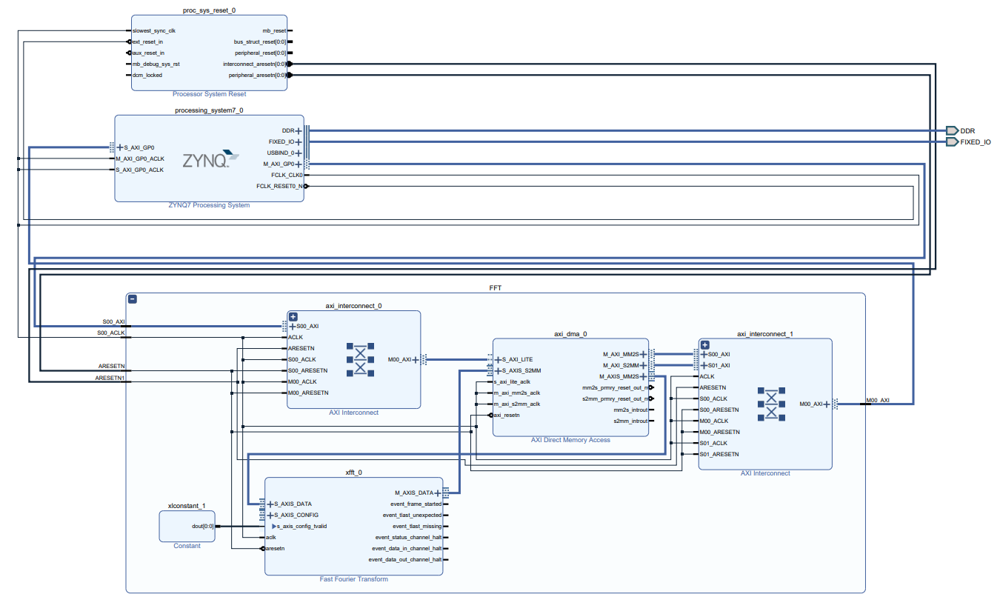
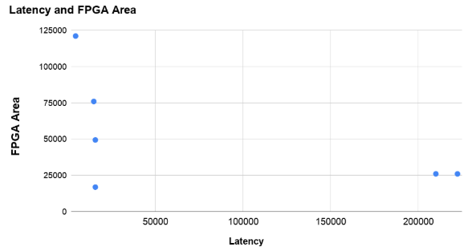
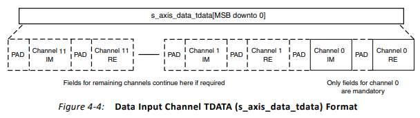
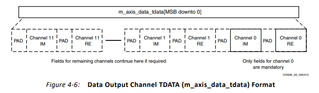
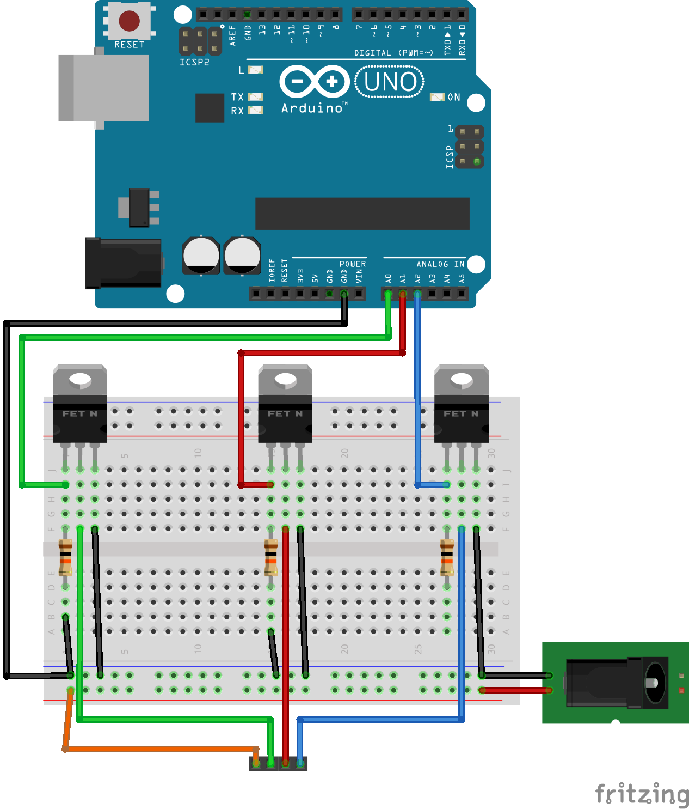

# PYNQ-182 Music Visualizer

> Karl Swanson, Peter Albanese

## Project Description

This project was developed as a final project for Advanced Digital Logic Design at Northeastern university. Our intent was to explore how a Fast Fourier Transform (FFT) could be implemented in hardware and software to enable a music visualizer. A FFT on a large dataset can be a tax on resources, and it is our belief that software utilizing FFTs may benefit from a hardware implementation on FPGA.

To accomplish our goals, we made use of the PYNQ-Z2 board which is based on the Xilinx Zynq SoC. The SoC design of the PYNQ allows for easy programming of FPGA fabric for creating optimized designs in hardware.

Our specific design makes use of AXI streaming to the Vivado FFT IP, a block diagram of our design is shown below.

## Analysis

### HLS Exploration
In designing this project we initially intended to design our own FFT IP block with HLS. The attempt to do this can be seen in the `hls` directory. The design is seemingly functional, and we were able to optimize it using the following:

| Optimizations                             | Latency | FPGA Area | DSP48E | FF    | LUT   |
|-------------------------------------------|---------|-----------|--------|-------|-------|
| None                                      | 222338  | 25934     | 75     | 12013 | 18434 |
| Pipeline first outer loop                 | 4342    | 121064    | 879    | 32996 | 33164 |
| Pipeline last loop                        | 210000  | 25960     | 75     | 12050 | 18460 |
| * Pipeline inner loop *                   | 15618   | 16810     | 49     | 8333  | 11910 |
| Pipeline inner loop, unroll outer         | 14730   | 75917     | 410    | 33913 | 34917 |
| Pipeline inner loop, unroll outer loop 32 | 15620   | 49354     | 229    | 23844 | 26454 |

These optimizations are visualized with in the following Pareto graph.

In the end we decided to go with the "Pipeline inner loop" optimization as it provided the best value with tradeoffs between latency and FPGA Area.

### Hardware Enabled FFT

Following the successful generation of our FFT overlay, we encountered some difficulty in properly formatting the data to send to the FFT. The documentation for the Vivado FFT IP can be found at [link](https://www.xilinx.com/support/documentation/ip_documentation/xfft/v9_1/pg109-xfft.pdf). The input and output format for the IP is located starting on page 30.

The input to the FFT is described below:

| Field Name | Width | Padded | Description                                                                                       |
|------------|-------|--------|---------------------------------------------------------------------------------------------------|
| XK_RE      | bxk   | Yes    | Real component (bxn = 8 - 34) in twos complement or single precision floating-point format.       |
| XK_IM      | bxk   | Yes    | Imaginary component (bxn = 8 - 34) in twos complement or single precision floating-point format.  |

The output from the FFT is described below:

| Field Name | Width | Padded              | Description          |
|------------|-------|---------------------|---------------------------------------------------------------------------------------------------------------------------------------------------------------------------------------------------------------------------------------------------------------------------------------------------------------|
| XK_RE      | bxk   | Yes - sign extended | Real component in twos complement or floating-point format. (For scaled arithmetic and block floating-point arithmetic, bxk = bxn. For unscaled arithmetic, bxk = bxn + log2 (maximum point size) +1. For single precision floating-point bxk = 32). |
| XK_IM      | bxk   | Yes - sign extended | Imaginary component in twos complement or single precision floating-point format. (For scaled arithmetic and block floating-point arithmetic, bxk = bxn. For unscaled arithmetic, bxk = bxn+ log2(maximum point size) +1. For single precision floating-point bxk = 32). |

While our project does successfully write to the AXI Stream, and data is properly transferred to the FFT block from AXI Direct Memory Access, it seems that our data format may be incorrect. This is something that could be improved upon by anyone who is interested in taking up this project.

## Usage

To run our project, please use the following steps. We will assume that you are familiar with the PYNQ board and it's file structure. For more information on this please see: https://pynq.readthedocs.io/en/latest/getting_started.html

If you would like to get lightstrip control working with this project, please connect a breadboard using the following Fritzing diagram.

For our implemenation, we used 3 logic level N-Channel MOSFETs with a terminal voltage ~3.1V. We additionally used 3 10kOhm resistors.

### Steps

1. Boot up PYNQ board as normal
2. Create a folder named `pynq-182/` in the `/home/xilinx/jupyter_notebooks/` directory
3. Copy all files from the `jupyter_notebooks/` directory to `pynq-182/`
4. Navigate to `/usr/local/lib/python3.6/dist-packages/pynq/overlays` using Windows File Explorer or a FTP session
5. Copy the `fft/` overlay directory from `./overlay/` to `/usr/local/lib/python3.6/dist-packages/pynq/overlays` 
6. Run Jupyter Notebooks as intended, enjoy!
